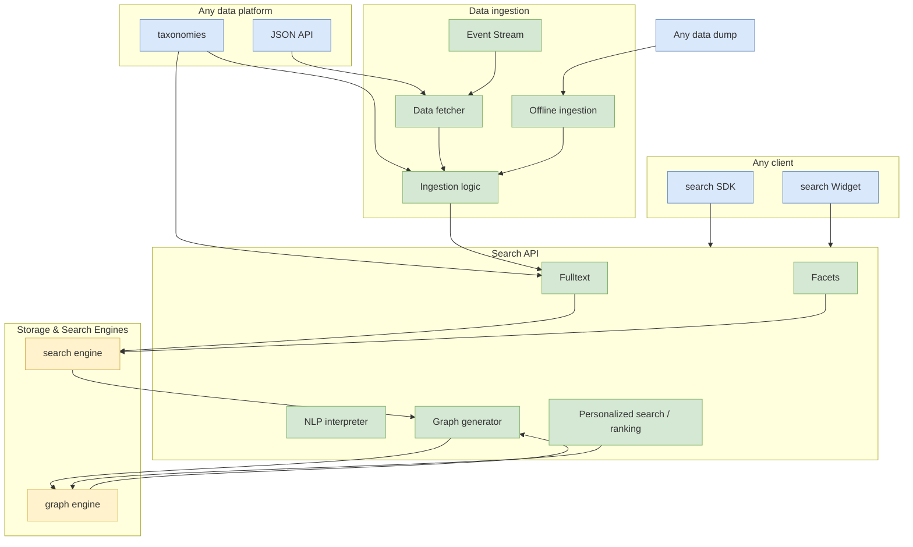

import { Callout } from "fumadocs-ui/components/callout";
import { Card, Cards } from "fumadocs-ui/components/card";
import { Steps, Step } from "fumadocs-ui/components/steps";

<Card
  title="Component Overview"
  href="/docs/Search-a-licious/devs/introduction"
>
  Refer to the introduction to get familiar with the main components
</Card>

## Architecture Overview

<Callout type="info">
  This diagram illustrates the main components and their interactions.
</Callout>

## Core Principles

<Steps>
<Step title="Best-in-Class Stack">

A very good stack with best in class open source components (see docker compose files)

</Step>
<Step title="Powerful API">

A very powerful API that is capable and easy to use. This is achieved through:

- Use of Lucene Query Language
- Abstracting complex processing under the hood (synonyms, language support, aggregations, etc.)

</Step>
<Step title="Simple Configuration">

A single, easy to use configuration file to declare your data structure and what you need to search

</Step>
<Step title="Flexible UI Components">

Web components to quickly build UIs while still being able to customize them in many scenarios

</Step>
</Steps>

## Architecture Benefits

<Cards>
  <Card
    title="Scalability"
    description="Built on proven open source technologies"
  />
  <Card
    title="Flexibility"
    description="Easy customization and integration options"
  />
  <Card
    title="Simplicity"
    description="Single configuration file for complete setup"
  />
  <Card
    title="Power"
    description="Advanced search capabilities with simple interfaces"
  />
</Cards>

## Historical Context

<Card
  title="Original Architecture Notes"
  href="https://docs.google.com/document/d/1mibE8nACcmen6paSrqT9JQk5VbuvlFUXI1S93yHCK2I/edit"
>
  The initial Search-a-licious roadmap architecture notes might be interesting
  to grasp the general idea of the project architecture.
</Card>
