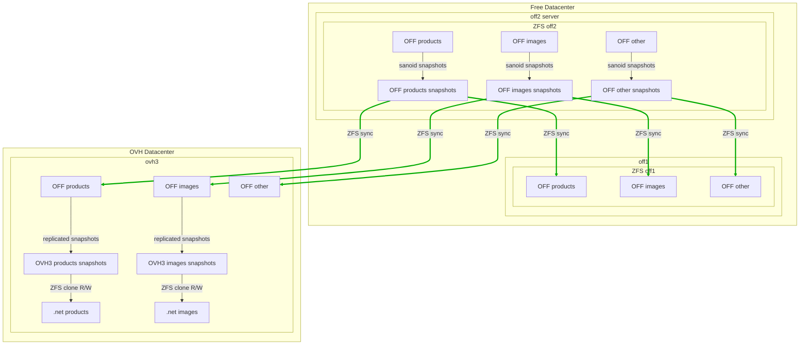

import { Callout } from "fumadocs-ui/components/callout";
import { Card, Cards } from "fumadocs-ui/components/card";
import { Steps, Step } from "fumadocs-ui/components/steps";
import { Tabs, Tab } from "fumadocs-ui/components/tabs";

# Production Architecture

<Card title="Open Food Facts Infrastructure" description="Comprehensive production deployment architecture">

This document outlines the complete production architecture of Open Food Facts, including server infrastructure, virtualization, configuration management, and deployment strategies.

</Card>

## Server Infrastructure

<Tabs items={["Primary Servers", "Secondary Services", "Virtualization"]}>
  <Tab value="Primary Servers">
    ### Primary Web Servers
    <Cards>
      <Card
        title="off1 & off2"
        description="Main web servers hosted at Free Datacenter"
        href="./free-datacenter.md"
      />
      <Card
        title="OVH Servers"
        description="Additional services hosted on OVH infrastructure"
      />
    </Cards>
  </Tab>

  <Tab value="Secondary Services">
    ### Service Distribution - **Main web application:** off1 and off2 (Free
    Datacenter) - **Supporting services:** OVH servers (ovh1, ovh2, ovh3) -
    **Image serving:** Dedicated nginx instances - **Database services:**
    Dedicated containers
  </Tab>

  <Tab value="Virtualization">
    ### Proxmox Platform
    <Card
      title="Virtualization Strategy"
      description="Open-source virtualization for container management"
    >
      We use the [Proxmox open-source virtualization platform](./proxmox.md) for
      managing LXC containers and virtual machines.
    </Card>
  </Tab>
</Tabs>

## Configuration Management

<Card title="Git-Based Configuration" description="Infrastructure as Code approach with Git version control">

### Configuration Strategy

We maintain server configurations in the [infrastructure git repository](https://github.com/openfoodfacts/openfoodfacts-infrastructure), cloned to `/opt/openfoodfacts-infrastructure` on each server.

<Steps>
  <Step title="Symlink Configuration">
    Files in `/etc` are symlinked to the git repository for automatic updates
    with `git pull`
  </Step>

  <Step title="Service Management">
    Updates may require service reloads, restarts, or `systemctl daemon-reload`
  </Step>

  <Step title="Proxmox Exception">
    `/etc/pve` cannot use symlinks (virtual filesystem), so files are copied to
    git after modifications
  </Step>
</Steps>

<Callout type="warn">
  Never commit secrets to the repository. Few files containing secrets exist
  outside version control.
</Callout>

### Current Status

<Tabs items={["Completed", "In Progress", "Planned"]}>
  <Tab value="Completed">
    - **off2:** Fully configured using git - **ovh3:** Partially configured
    using git
  </Tab>

  <Tab value="In Progress">
    - Configuration files: `confs/off2/` directory - Scripts: `scripts/off2/`
    directory
  </Tab>

  <Tab value="Planned">
    - **TODO:** Complete git configuration for ovh1 and ovh2 - **TODO:**
    Automate `/etc/pve` file sync for important (non-secret) files
  </Tab>
</Tabs>

**Related Documentation:**

- [Explanation on server configuration with git](./explain-server-config-in-git.md)
- [How to have server config in git](./how-to-have-server-config-in-git.md)

</Card>

## NGINX Proxy Architecture

<Card title="Reverse Proxy Setup" description="Cascading NGINX configuration with security features">

### Proxy Structure

We implement a [NGINX reverse proxy](./nginx-reverse-proxy.md) container that may cascade to installation-specific NGINX instances, which then cascade to Apache for some requests.

### Security Features

<Steps>
  <Step title="Bot Protection">
    Uses fail2ban to automatically ban malicious bots
  </Step>

  <Step title="Rate Limiting">
    Implements traffic control and request limiting
  </Step>

  <Step title="SSL Termination">
    Handles SSL certificates and HTTPS termination
  </Step>
</Steps>

<Callout type="info">
  Special exception: `images.openfoodfacts.org` is served by nginx installed
  directly on the host (off2 or ovh3).
</Callout>

**Related:** [How to use fail2ban to ban bots](./how-to-fail2ban-ban-bots.md)

</Card>

## Product Opener Deployment

<Card title="Container-Based Deployment" description="One application per LXC container architecture">

### Container Strategy

<Tabs items={["Application Containers", "Shared Services", "Request Flow"]}>
  <Tab value="Application Containers">
    Each Product Opener instance runs in its own LXC container: - **Public
    flavors:** off, opf, opff, obf - **Producer Platform:** Separate container
    (currently off only) ### Container Components Each container includes: -
    **nginx:** Frontend web server - **apache:** Backend application server -
    **minion:** Background job processor - **incron:** File system event
    processor
  </Tab>

  <Tab value="Shared Services">
    Databases are shared between instances:
    <Cards>
      <Card title="MongoDB" description="Primary document database" />
      <Card
        title="PostgreSQL"
        description="Relational database for structured data"
      />
      <Card title="Memcached" description="Distributed memory caching system" />
    </Cards>
  </Tab>

  <Tab value="Request Flow">
    ### Request Processing Path
    <Steps>
      <Step title="Reverse Proxy">
        Client requests hit the main NGINX reverse proxy
      </Step>

      <Step title="Project NGINX">
        Forwarded to project-specific NGINX instance
      </Step>

      <Step title="Apache Backend">Dynamic requests processed by Apache</Step>

      <Step title="Static Resources">
        Static files served directly by project NGINX
      </Step>
    </Steps>
    <Callout type="info">
      The dual NGINX setup provides flexibility and easier management with
      project-specific rules.
    </Callout>
  </Tab>
</Tabs>

### Container Configuration

<Card title="Git-Based Container Config" description="Version-controlled container configurations">

**Strategy:** Container configurations are stored in the main Product Opener repository and symlinked in `/etc/` for automatic updates on `git pull`.

<Callout type="warn">
  Beware not to put files with secrets in version control!
</Callout>

</Card>

</Card>

## Folder Structure

<Card title="Deployment Layout" description="Standardized directory structure for deployments">

### Design Principle

<Callout type="info">
  Deployments should only require `git pull` + build commands (like
  `build_lang`). We maintain git repository layout and add only necessary
  symlinks to data.
</Callout>

### Important Paths

<Tabs items={["Code Directories", "Static Assets", "External Mounts", "Cross-Instance Access"]}>
  <Tab value="Code Directories">
    - **`/srv/<flavor>`:** Main code (git repository clone)
    - **`/srv/openfoodfacts-web`:** Web repository with static content
  </Tab>
  
  <Tab value="Static Assets">
    - **`/srv/<flavor>-static`:** Compiled static assets
    - Static archives are extracted here on release
  </Tab>
  
  <Tab value="External Mounts">
    - **`/mnt/<flavor>`:** External ZFS datasets mounted into VM
  </Tab>
  
  <Tab value="Cross-Instance Access">
    - **`/mnt/<other-flavor>`:** Access to other instance data
    - Symlinked under `/srv/<other-flavor>` directory
  </Tab>
</Tabs>

<Callout type="warn">
  **Refactoring Needed:** The folder structure needs simplification to use fewer
  volumes: data, caches, and configuration data.
</Callout>

</Card>

## Storage Architecture

<Card title="ZFS-Based Storage" description="Comprehensive data storage strategy with ZFS datasets">

### Storage Principles

<Steps>
  <Step title="Separation">
    Maintain strict separation between data and software
  </Step>

  <Step title="ZFS Datasets">All data stored on dedicated ZFS datasets</Step>

  <Step title="Bind Mounts">
    Datasets mounted in containers using Proxmox bind mounts
  </Step>
</Steps>

### Dataset Categories

<Tabs items={["Shared Data", "Flavor-Specific", "Instance-Specific", "Other Data"]}>
  <Tab value="Shared Data">
    **Shared between all installations:**
    - **users:** `/mnt/<flavor>/users`
    - **orgs:** `/mnt/<flavor>/orgs`
  </Tab>
  
  <Tab value="Flavor-Specific">
    **Shared between producer and public platform:**
    - **product images:** `/mnt/<flavor>/images/`
    - Linked in `html/images/` directory
  </Tab>
  
  <Tab value="Instance-Specific">
    **Specific to each flavor:**
    - **products:** `/mnt/<flavor>/products`
    - **html_data:** `/mnt/<flavor>/html_data` (linked in `html/data`)
  </Tab>
  
  <Tab value="Other Data">
    **Additional data categories:**
    - Static data and default configurations
    - External data (ecoscore, emb_codes, forest-footprint)
    - Taxonomies, templates, translations (po, lang)
    - Cache data (build-cache, tmp, debug, new_images)
    - Logs and user email storage
  </Tab>
</Tabs>

### Proxmox Integration

<Card title="Bind Mount Configuration" description="ZFS dataset mounting in Proxmox containers">

Datasets are mounted using Proxmox Mount Point (`mp<number>`) entries in container configuration.

**Reference:** [Bind mounting ZFS Datasets in Proxmox](./proxmox.md#bind-mounting-zfs-datasets)

</Card>

### Storage Flow Diagram

```mermaid title="Storage on ZFS Datasets and mounting in containers (principle)"
flowchart TD
    subgraph freeDC["Free Datacenter"]
        subgraph off2["off2 server"]
            subgraph container["off-container"]
                srvProducts["/srv/off/products"] --> |symlink| mntProducts["/mnt/off/products"]
                srvImages["/srv/off/html/images/products"] --> |symlink| mntImages["/mnt/off/images"]
                srvOther["/srv/off/xxx"] --> |symlink| mntOther["/mnt/off/xxx"]
                srvProImages["/srv/off-pro/html/images/products"] --> |symlink| mntProImages["/mnt/off-pro/images"]
            end
            subgraph zfs["ZFS"]
                OFF2products["OFF products"]
                OFF2images["OFF images"]
                OFF2other["OFF other"]
                OFF2ProImages["OFF pro images"]
                OFF2products --> |Bind mount| mntProducts
                OFF2images --> |Bind mount| mntImages
                OFF2other --> |Bind mount| mntOther
                OFF2ProImages --> |Bind mount| mntProImages
            end
        end
    end
```

</Card>

## ZFS Storage Synchronization

<Card title="Backup and Replication Strategy" description="Comprehensive data protection with ZFS snapshots and sync">

### Synchronization Tools

<Steps>
  <Step title="Sanoid Snapshots">
    Creates snapshots and manages retention policies
  </Step>

  <Step title="Syncoid Replication">
    Synchronizes snapshots between servers
  </Step>

  <Step title="Clone Creation">
    Uses snapshots for staging environment data
  </Step>
</Steps>

### Replication Flow



### Tools and Configuration

<Cards>
  <Card
    title="Sanoid"
    description="Snapshot management and retention policies"
    href="./sanoid.md"
  />
  <Card
    title="Syncoid"
    description="Snapshot synchronization between servers"
    href="./sanoid.md#syncoid-service-and-configuration"
  />
  <Card
    title="Staging Clones"
    description="Data provision for staging environments via ZFS clones"
  />
</Cards>

<Callout type="info">
  OVH3 or OFF2 images are also served by NGINX for `images.openfoodfacts.org`.
</Callout>

</Card>

## Network Architecture

<Card title="Internal Communication" description="Secure inter-service communication strategy">

### Communication Principles

<Steps>
  <Step title="Internal Network">
    All applications communicate using internal network addresses
  </Step>

  <Step title="Inter-Server Security">
    Communication between machines uses Stunnel or HTTPS
  </Step>

  <Step title="Authentication">
    Stunnel with PSK (Pre-Shared Key) for fast, secure connections
  </Step>
</Steps>

### Stunnel Configuration

<Tabs items={["Advantages", "Configuration", "Security"]}>
  <Tab value="Advantages">
    - **TCP Streams:** Handles any TCP stream (not UDP) - **No Firewall Rules:**
    No need for specific firewall configuration - **Built-in Auth:** Uses
    specific authentication mechanism
  </Tab>

  <Tab value="Configuration">
    - **PSK Method:** Pre-Shared Key for speed and simplicity - **Unique Keys:**
    Each server connection uses unique PSK - **TCP Only:** Limited to TCP
    traffic (UDP not supported)
  </Tab>

  <Tab value="Security">
    - **Encrypted Tunnels:** All inter-server communication encrypted -
    **Authentication:** PSK-based connection authentication - **No Open Ports:**
    No additional firewall rules required
  </Tab>
</Tabs>

### Architecture Diagram

<Callout type="info">
  The following diagram shows network connections (not complete). Source
  available in
  [architecture-diagram.drawio](/docs/Infra/img/architecture-diagram.drawio).
</Callout>


</Card>

## Future Improvements

<Callout type="warn">
Several areas need refactoring and improvement:

1. **Storage simplification:** Reduce to fewer volumes (data, caches, configuration)
2. **Cross-instance dependencies:** Make data access more configurable
3. **Configuration automation:** Automate `/etc/pve` file synchronization
4. **Complete git migration:** Finish git-based configuration for all servers
   </Callout>

## Related Documentation

<Cards>
  <Card
    title="Proxmox Setup"
    description="Virtualization platform configuration"
    href="./proxmox.md"
  />
  <Card
    title="NGINX Proxy"
    description="Reverse proxy configuration and management"
    href="./nginx-reverse-proxy.md"
  />
  <Card
    title="Free Datacenter"
    description="Primary hosting infrastructure details"
    href="./free-datacenter.md"
  />
  <Card
    title="Sanoid/Syncoid"
    description="ZFS snapshot and replication management"
    href="./sanoid.md"
  />
  <Card
    title="Server Config Git"
    description="Version control for server configurations"
    href="./explain-server-config-in-git.md"
  />
  <Card
    title="Fail2ban Setup"
    description="Bot protection and traffic filtering"
    href="./how-to-fail2ban-ban-bots.md"
  />
</Cards>
