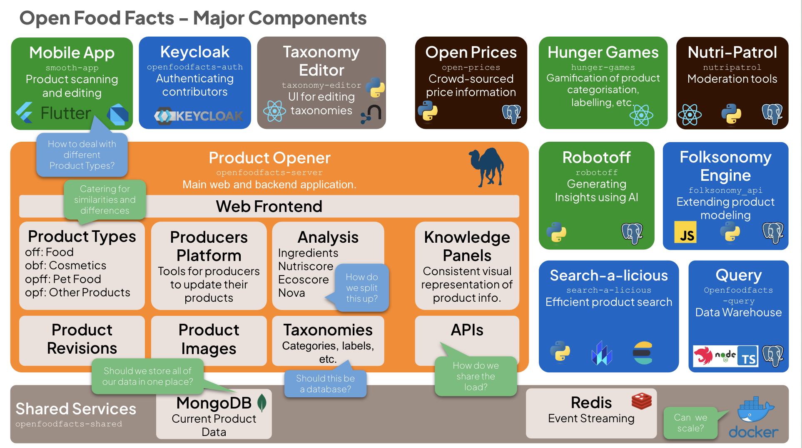

import { Card, Cards } from "fumadocs-ui/components/card";
import { Callout } from "fumadocs-ui/components/callout";
import { Steps, Step } from "fumadocs-ui/components/steps";

# Open Food Facts Documentation

Welcome to the comprehensive documentation for the Open Food Facts ecosystem. Our platform provides access to the world's largest collaborative food database and related services, powering applications that help people make better food choices.

## What is 🍊 Open Food Facts?

### A food products database

Open Food Facts is a database of food products with ingredients, allergens, nutrition facts and all the tidbits of information we can find on product labels.

### Made by everyone

Open Food Facts is a non-profit association of volunteers. 25,000+ contributors like you have added 1.7 million+ products from 150 countries using our Android, iPhone or Windows Phone app or their camera to scan barcodes and upload pictures of products and their labels.

### For everyone

Data about food is of public interest and has to be open. The complete database is published as open data and can be reused by anyone and for any use. All our APIs and services are free to use!

<Callout type="info">
  Open Food Facts is a collaborative, free and open database of food products
  from around the world. All data is available under open licenses, enabling
  innovation in food transparency.
</Callout>

## Technical Documentation

If you are here, you might be looking for technical documentation about our projects. This comprehensive documentation covers all the APIs, services, and infrastructure that power the Open Food Facts ecosystem.

## Core Services

<Cards>
  <Card
    title="Product Opener"
    description="Core backend system powering Open Food Facts with API endpoints, database, and web interface"
    href="/docs/Product-Opener"
  />
  <Card
    title="Robotoff"
    description="AI-powered service for automated product data extraction using computer vision and ML"
    href="/docs/Robotoff"
  />
  <Card
    title="Knowledge Panels"
    description="FastAPI service providing structured, ready-to-display knowledge panels for products"
    href="/docs/Knowledge-Panel"
  />
  <Card
    title="Open Prices"
    description="Global price database with location-based pricing information and analytics"
    href="/docs/Open-prices"
  />
  <Card
    title="Folksonomy Engine"
    description="Collaborative tagging system for adding custom properties to products"
    href="/docs/folksonomy"
  />
  <Card
    title="Search-a-licious"
    description="Ready-to-use search component built on Elasticsearch for data exploration"
    href="/docs/Search-a-licious"
  />
  <Card
    title="Infrastructure"
    description="Server architecture, hosting, and technical infrastructure documentation"
    href="/docs/Infra"
  />
</Cards>

## Getting Started

<Steps>
  <Step title="Choose Your Service">
    Select the service that best fits your needs from our comprehensive
    ecosystem
  </Step>
  <Step title="Explore the Documentation">
    Each service has detailed API references, guides, and examples
  </Step>
  <Step title="Start Building">
    Use our APIs and services to build applications that promote food
    transparency
  </Step>
</Steps>

## Quick Access Guide

Choose the documentation section that best fits your needs:

- **Product Data**: Use [Product Opener API v2](/docs/Product-Opener/v2) or [API v3](/docs/Product-Opener/v3) for accessing product information, nutrition data, and images
- **Smart Insights**: Use [Knowledge Panels](/docs/Knowledge-Panel) for structured, ready-to-display product information
- **AI Predictions**: Use [Robotoff](/docs/Robotoff) for machine learning predictions and annotation workflows
- **Price Information**: Use [Open Prices](/docs/Open-prices) for product pricing data and store locations
- **Search Engine**: Use [Search-a-licious](/docs/Search-a-licious) for powerful Elasticsearch-based search capabilities
- **Tagging System**: Use [Folksonomy Engine](/docs/folksonomy) for collaborative product tagging

<Callout type="success">
  All APIs are free to use and don't require authentication for read operations.
  Check individual API sections for specific usage guidelines.
</Callout>

## How can I help?

### Translate Open Food Facts

You can help translate the Open Food Facts web version and the app at [translate.openfoodfacts.org](https://translate.openfoodfacts.org/) (no technical knowledge required, takes a minute to signup)

### Contribute to the Code

Check out our [GitHub organization](https://github.com/openfoodfacts) to find projects you can contribute to

### Join the Community

- [Community Forum](https://forum.openfoodfacts.org) - Ask questions and discuss features
- [Developer Slack](https://slack.openfoodfacts.org) - Real-time chat with developers
- [Contributor Guide](https://wiki.openfoodfacts.org/Contributor) - Learn how to get started

## Additional Resources

- [Open Food Facts Website](https://openfoodfacts.org) - Main website for product exploration
- [Data Exports](https://world.openfoodfacts.org/data) - Download complete database exports
- [Mobile Apps](https://world.openfoodfacts.org/discover) - Official mobile applications
- [Discover](https://world.openfoodfacts.org/discover) - Explore cool reuses and applications
