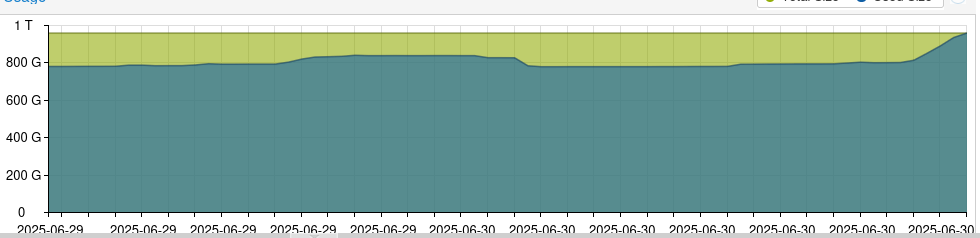

# 2025-06-30 OVH3 disk full post-mortem

## Symptoms

While running the general assembly on 2025-06-30 wiki was no more accessible.

After checking, we got a "no space left on device".

Their is a steady augmentation of the disk used space, and the zpool is effectively saturated. (`zpool list rpool`)



## Remediation 1

I decided to remove some snapshots that where already synchronized on vm200 disk, gaining maybe 30G.

I did new that after this kind of incident, you have to restart everything because otherwise many might be in degraded mode.

Then I restarted all containers. But vm didn't want to restart. So finally I did go for a full restart of the server (which is the right way to go).

But after a while (30 min or so), disk was full again.

## Remediation 2

Not seeing any obvious fix [vm-200-disk], I decided to remove the monitoring disk.

I already have stop the vm (as monitoring was moved).
I did not remove the vm, in case we should spin it again,
but just removed it's disk using zfs.
Before I did check we add synced data on ovh3.
```bash
# USE WITH CAUTION
zfs destroy -r rpool/vm-203-disk-0
```
This gave 130 Go of free space (note: you have to wait a bit before `zpool list` shows it).

I modified vm203 options to tell it not to automatically start at boot time.

At this point, I did reboot the host (ovh1) and wait until it was up.

As a measure of security, though, I did go on staging vm (200) and stopped the search-a-licious service (in `/home/off/searchalicious-net`)

[^vm-200-disk]: I did list the snapshot of vm-200-disk-2
  and did not find a big variation but this was the wrong disk to check…
  for historical reasons, the disk with data is vm-200-disk-0 instead.
  If I would have checked the right disk I might have been able to remove more snapshots and recover disk space.

## Cleaning 

On ovh3 I removed the synchronization line for ovh1 vm-203-disk-0 in syncoid.conf, and modified sanoid.conf to say that this dataset must follow the local_data policy.
This way we can keep it for sometime, until we decide to remove it completely.

See [commit 7867b48d5daa061ad3e3c40be3f924244d07a964](https://github.com/openfoodfacts/openfoodfacts-infrastructure/commit/7867b48d5daa061ad3e3c40be3f924244d07a964)

## Lessons learned

We have to be carefull with ES and ZFS snapshots, as ES systematically rewrites indexes files to the disk,
leading to rapid increase of disk used space if we keep snapshots.
